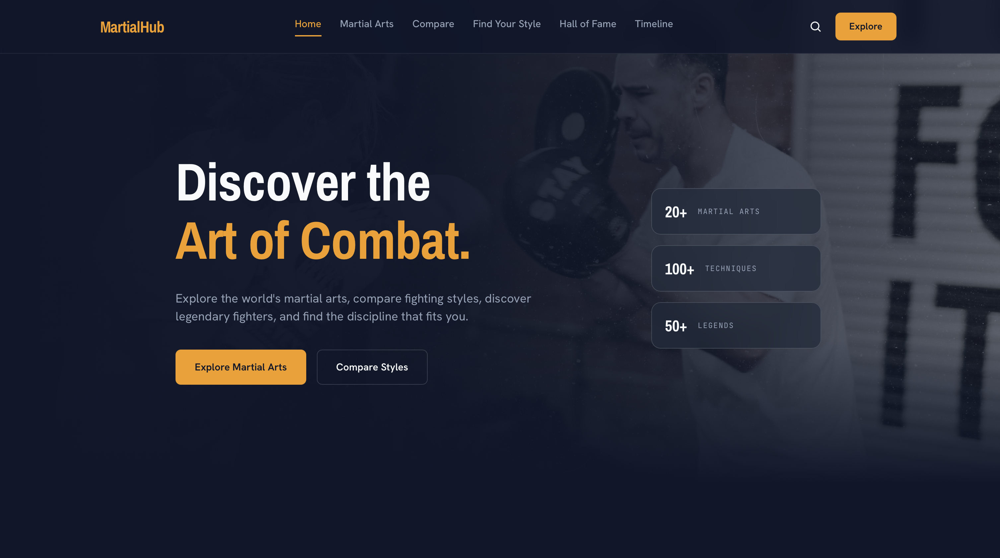

# MartialHub

A modern, data-driven platform for exploring, comparing, and understanding
different martial arts — built as a frontend engineering portfolio project.

🔗 **[Live Demo](your-deployed-link-here)**

## About

MartialHub lets users browse martial arts disciplines, compare fighting
styles side-by-side, take a quiz to find which style suits them, and explore
legendary fighters and historical milestones — all from a single, reusable
data source with no backend.

I built this to practice component architecture, state-driven UI, data
visualization, and responsive design in React, without leaning on a UI
framework like Bootstrap or Tailwind.

## Features

- 🥊 **Martial Arts Library** — filterable grid of disciplines by category
- ⚖️ **Compare** — pick any two styles and compare them across 7 attributes
  with animated bars
- 🧭 **Find Your Style Quiz** — answers are scored against real discipline
  ratings to recommend a match
- 📊 **Data visualization** — Recharts-powered comparison chart
- 🏆 **Hall of Fame** — legendary fighters by discipline
- 🕓 **Timeline** — chronological origins of major disciplines
- 📱 Fully responsive, dark/cinematic sports-tech design system

## Tech Stack

- React + Vite
- React Router
- Framer Motion (animations)
- Recharts (data viz)
- CSS Modules (no UI framework — all styling written by hand)

## Architecture Notes

- All content lives in `src/data/` (`martialArts.js`, `fighters.js`,
  `quiz.js`, `timeline.js`) as a single source of truth — the same
  `martialArts.js` file powers the library, details page, compare tool,
  and quiz scoring, so there's no duplicated data anywhere.
- Components are organized by responsibility (`components/`) and composed
  into pages (`pages/`) — e.g. `MartialArtCard` is reused across the
  homepage, library, and quiz results.
- Quiz results are computed by averaging a discipline's ratings against
  the attributes the user selected — not hardcoded outcomes.

## Running Locally

\`\`\`bash
git clone https://github.com/your-username/martialhub.git
cd martialhub
npm install
npm run dev
\`\`\`

## What I'd Improve Next

- [ ] Add a real backend/CMS for content management
- [ ] Persist quiz results / favorites via localStorage
- [ ] Add unit tests for the quiz scoring logic

## License

MIT